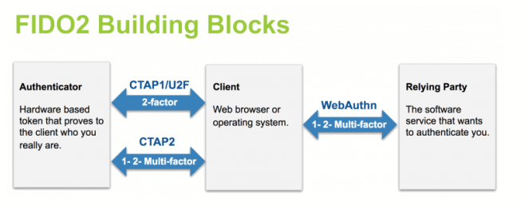

== FIDO2/WebAuthn Overview
Compromised credentials continue to be the top cause of data breaches. Many online services still use a password as the single factor to authenticate users. In response, some have moved to two-factor authentication (2FA) but have faced user experience challenges and found that weak 2FA options are still vulnerable to phishing attacks. Developers must implement security measures to protect user passwords in transit and at rest. Meanwhile, users must remain ever vigilant to remember their password, rotate it, and ensure it meets complexity and uniqueness requirements. Enterprises and consumer facing services continue to seek a simple, secure, and scalable user authentication experience.

=== Problems with traditional credentials
* Strong passwords can be difficult to remember, and users often reuse passwords on multiple sites
* Server breaches can expose symmetric credentials (passwords)
* Passwords are subject to replay attacks
* Users can inadvertently expose their passwords in phishing attacks.
* Even properly salted and hashed passwords can be cracked by offline dictionary attacks if database is leaked

== Introducing FIDO2/WebAuthn authentication
FIDO2/WebAuthn offers a strong Multi-Factor Authentication (MFA) framework to minimize or replace the use of passwords with scoped public key-based credentials that are resistant to phishing, replay, and server breach attacks. User gestures such as PINs, touch, or biometrics are used to authorize use of FIDO2 credentials.

== Multi-Factor Authentication
MFA is a method of granting access to a system only after two or more pieces of evidence have been presented. These pieces of evidence, also known as factors, prove your identity. This could be something you know (secret password or PIN), something you have (mobile phone or security key), or something you are (biometrics: fingerprint or face). You’ve probably already used MFA in some form if you have withdrawn money from an ATM.

* Your identity was proven by the bank before your account was created
* The bank card is the something you have
* The PIN is the something you know

== Importance of FIDO2/WebAuthn credentials
FIDO2/WebAuthn credentials provide strong authentication that is resistant to phishing, replay, and server breach attacks. Strong authentication is defined as having at least one cryptographically backed factor. FIDO2 provides strong, attested, scoped public key-based credentials for authenticating users.

FIDO2/WebAuthn authentication is decentralized. Users are authenticated locally on an authenticator. The online service validates the authentication ceremony was properly conducted before allowing user access. The online service only needs publicly available information to validate the local authentication. This reduces the value of attacking the server because it has no user authentication secrets and user credentials are also not transferable between services.

Attestation becomes important now that authentication is decentralized. The online service must trust that the authenticator reliably conducts FIDO2 ceremonies. FIDO2 provides a mechanism for authenticators to present an attestation statement so that an online service can verify it is a genuine device.

FIDO2 credentials can provide MFA by employing user verification authorization gestures. This could be a PIN or biometric, for example. This user verification stays on the authenticator, it is never sent over the network like a password. If MFA is not required, then a simple test of user presence through an authorization gesture, e.g. tap and go, can show that the user gave consent for the credential to be used.

== Public key-based credentials
In general, a credential is data that proves a person’s identity or qualification. This credential is used to authenticate to an online service, also known as a Relying Party (RP). FIDO2 uses public-key cryptography to authenticate users. An RP-specific credential key pair, i.e., a private key and a public key, is generated on the authenticator. The public key is sent to the RP at registration time. The private key never leaves the authenticator. When the user makes the request to login, the authenticator sends an assertion that proves the user possesses the private key. The RP uses the public key to validate the assertion before allowing the user to login.

FIDO2 introduces the concept of a resident key credential, which is/are stored on the authenticator instead of encrypted and stored on the server. Resident keys also enable passwordless authentication scenarios, at the expense of consuming limited storage space on the authenticator.

== Where FIDO2/WebAuthn credentials should be used
FIDO2/WebAuthn credentials with MFA should be used whenever possible, especially when it comes to sensitive data, like your primary email, financial accounts, and health records.

== FIDO2 is based on open standards

FIDO2 is built on top of two open standards: the Web Authentication API (WebAuthn) and the Client to Authenticator Protocol (CTAP2). The two work together and are required to achieve a strong authentication experience. The earlier FIDO U2F protocol working with external authenticators is now renamed CTAP1 in the FIDO specifications. FIDO2 and WebAuthn are backwards compatible with U2F authenticators.

== How it works
FIDO2/WebAuthn authentication consists of a registration ceremony and an authentication ceremony.

=== Registration Ceremony
Assuming a user has already created an account with the online service, the user registers one or more authenticators against that identity. The authenticator could be a mobile phone, laptop, or YubiKey. Any authenticator that is compliant with CTAP1 or CTAP2 will work.

During the registration ceremony the authenticator creates a FIDO2 credential by generating a private key and public key. The private key stays in the hardware’s secure element while the public key is given to the online service. Possession of this authenticator in combination with a gesture to unlock the use of the credential is now proof of your identity. Unlike a password which is sent over the network and stored on a remote server, neither the private key nor the gesture ever leave the authenticator. They are not sent over the network nor stored on a remote server. Only the public key is stored by the online service.

=== Authentication ceremony
Authentication happens locally on the authenticator and is verified by the online service. First, a user will make a request to login. The online service will send the client some data, which includes a challenge. Next, the client requests cryptographic proof of user authentication. With the user's consent, the authenticator will return an assertion. This assertion provides evidence that the authenticator is in possession of the private key by signing the client data with the private key. The server then verifies the client data has not been tampered with and uses the public key to verify the signature.

== User login flows supported
Example FIDO2/WebAuthn authenticator flows:

* **Single factor:** Username + FIDO2 credential
* **Second factor:** Username + password + FIDO2 credential
* **Passwordless single factor:** FIDO2 resident key credential (a ‘resident key’ stores user data on the authenticator)
* **Passwordless MFA:** FIDO2 resident key credential + PIN

FIDO2 is also backwards-compatible with FIDO U2F authenticators

* **Single factor:** Username + FIDO U2F credential
* **Second factor:** Username + password + FIDO U2F credential

== FIDO2/WebAuthn application architecture

image::fido2_app_architecture.png[]

In general, a FIDO2/WebAuthn authentication architecture involves a conversation between a computing environment controlled by a Relying Party and one controlled by the user to be authenticated.

=== FIDO2 Authenticator
The user environment may consist of a client computing device with internal FIDO2 authenticator. The user may also have an external FIDO2 authenticator, such as a YubiKey, which can roam between devices. The authenticator makes credentials, generates cryptographic proof of user authentication, and manages the PIN.

=== Client/Platform
The client is the bridge between the authenticator and the RP. It implements CTAP2 and client-side WebAuthn API. The client could be a browser exposing the WebAuthn API to web applications, or an OS subsystem exposing a platform-specific FIDO API to native applications such as mobile or desktop apps.

=== Relying Party
The Relying Party's environment consists conceptually of at least a web server and the server-side portions of a web application, plus a WebAuthn server. The WebAuthn server has a trust store, containing the (public) trust anchors for the attestation of FIDO2 Authenticators. Note: a trust store is needed only if RP cares about attestation metadata.

== Key Points
* FIDO2 credentials are based on an public key cryptographic key pair.
* The identity provider validates user identity and maps a FIDO2 credential public key to a user account during the registration step
* FIDO2 credentials can be generated in hardware devices (e.g. security keys, mobile phones, laptops, etc…)  or software, based on policy.
* Authentication uses a cryptographic key tied to a device and, optionally, something that the person knows (a PIN) or something that the person is (biometric gesture). PINs and biometric gestures do not roam between devices and are not shared with the server; they are stored locally on a device.
* The user’s private key never leaves a device. The authenticating server has a public key that is mapped to the user account during the registration process.
* PIN entry, biometric gesture, or touch trigger the device to unlock the private key to cryptographically sign data that is sent to the identity provider in the assertion. This signed data also indicates whether or not a PIN or biometric was used. The authentication request is allowed to proceed after the identity provider verifies the assertion.

link:/Best_Practices.html[Next: WebAuthn Deployment Best Practices]
