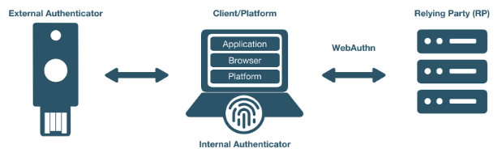

== WebAuthn/FIDO2 Readiness Checklist ==

This applies to: FIDO2, WebAuthn, U2F, CTAP1, CTAP2.

Use the following checklist to ensure you have completed all the steps in your WebAuthn integration.

_Note: Some sections might not apply to your solution._

== Design

=== User Authentication Flows

Select the user authentication flows your solution will support:

* Single Factor Passwordless - Username and FIDO2 factor
* Second Factor - Username, password, and FIDO second factor (U2F)
* Multi-factor Authentication - FIDO2 factor and PIN

=== Platforms

Select the browsers and/or platforms your solution will support:

==== Browsers (not an exhaustive list)

* Android Browser
* Brave
* Brave on iOS
* Chrome
* Chrome for Android
* Edge
* Firefox
* Firefox for Android
* Opera
* Safari

==== Platforms

* Windows
* Mac
* Linux
* iOS
* Android

=== Authenticators

Select the authenticator types, protocols, and transports your solution will support:

==== Authenticator Types

* Platform (Android biometric, Mac biometric, Windows Hello, etc…)
* Cross-Platform (YubiKey, etc…)

==== Authentication Protocols

* CTAP1 (U2F)
* CTAP2 (FIDO2)

==== Transports

* Bluetooth
* Lightning
* NFC
* USB

=== Extensions

Both the WebAuthn and FIDO CTAP2 specifications provide for supporting a variety of extensions. Select the protocol extensions your solutions will support:

==== WebAuthn Extensions:

* FIDO AppID: use if migrating from U2F to WebAuthn.

==== CTAP Extensions:

* HMAC Secret
* Cred Protect

== Server-Side

* This section applies only if your solution implements the WebAuthn relying party operations.

=== User Verification

To avoid unintended or unexpected user interaction, we recommend explicitly setting user verification (UV) for your specific solution’s use case.

Because enabling user verification will cause the user to be prompted for a PIN to complete the WebAuthn operation, UV is helpful only for FIDO2 and WebAuthn implementations. For second factor flows, we recommend setting UV to discourage a PIN prompt.

==== Scenario 1: WebAuthn and FIDO2 Implementations

Request authenticator to require UV on registration and authentication

* Set userVerification to “required” in the PublicKeyCredentialCreationOptions
* Set userVerification to “required” in the PublicKeyCredentialRequestOptions

==== Scenario 2: Second Factor Flows

Request authenticator to minimize disruption in user interaction flow

* Set userVerification to “discouraged” in the PublicKeyCredentialCreationOptions.

  _Note: if the PIN has already been set, the user might be prompted to enter a PIN_

* Set userVerification to “discouraged” in the PublicKeyCredentialRequestOptions

=== Attestation

The Attestation Object is applicable only to CTAP2 and WebAuthn implementations. Refer to the https://www.w3.org/TR/webauthn/#sctn-attestation[W3C standard] to learn more. We recommend always saving the raw attestation statement after every credential creation.

_Note: The WebAuthn default is set to ``none``, meaning the authenticator will not send the attestation statement._

* Set attestation to ``direct`` in the ``PublicKeyCredentialCreationOptions``
* Save the raw attestation statement to your data store
* Get and store additional metadata about the authenticator model (e.g., image of device, etc.)
* Use the attestation transport hint to guide the user interactions (e.g., if no NFC-enabled credentials, then prompt user to insert security key)

=== Additional Restrictions

* We recommend your solution not limit access based on authenticator model or attestation statement, unless required by your use case.
* We recommend your solution not limit access based on the user-agent value reported by the browser.

== Authenticator Lifecycle

* Users must be able to register at least two security keys per account (one primary and one backup)
* Users must be able to name or rename a registered security key
* Users should be presented with the date and time when the key was last used
* Users must be able to remove a registered security key from their account
* Administrators should be able to remove a registered security key on behalf of a user if authorized.
* Users should be able to configure a range of other account recovery options if all security keys are lost (e.g., backup codes, etc…)
* Provide instructions to inform users how to register, authenticate, and remove security keys.

== Testing Your Integration

Test with your users’ browsers and devices.

=== Stability

The solution must not freeze, crash, rapidly drain battery, or put unnecessary strain on device resources.

=== User Experience

The solution must communicate YubiKey status to users. This section does not apply if using a FIDO2/WebAuthn-compatible browser.

* Display an animation to indicate that the security key should be inserted or guide the user to the appropriate location for NFC.
* Display an animation to prompt the user to take action on the security key.

=== Branding

Your solution must follow the https://www.yubico.com/press/images/[Yubico usage guidelines] when presenting the Yubico image or logo.

=== Functional Testing

Perform all the following tests. Before performing each test, enable or disable as required the specified YubiKey functionality. For this, the https://developers.yubico.com/yubikey-manager/[YubiKey Manager] might be necessary in order to enable/disable specific functionality of your YubiKey.

* Register a YubiKey (only CTAP1/U2F enabled)
* Register a YubiKey (only CTAP2/FIDO2 enabled)
* Register a second YubiKey (only CTAP1/U2F enabled)
* Register a second YubiKey (only CTAP2/FIDO2 enabled)
* Prompt to insert YubiKey as appropriate for registration
* Prompt to touch YubiKey as appropriate for registration
* Gracefully recover if a YubiKey is not present for registration
* Gracefully recover if a YubiKey is not touched for registration
* Authenticate using YubiKey (CTAP1/U2F enabled)
* Authenticate using YubiKey (CTAP2/FIDO2 enabled)
* Prompt to insert YubiKey as appropriate for authentication
* Prompt to touch YubiKey as appropriate for authentication
* Gracefully recover if a YubiKey is not presented for authentication
* Gracefully recover if a YubiKey is not touched for authentication
* Unregister/remove a YubiKey (self-service or admin request)
* Name or rename registered YubiKey
* Prevent the same user from registering the same YubiKey multiple times
* For second factor use cases do not prompt for PIN when authenticating (CTAP2/FIDO2 only)
* Login with unregistered key is rejected
* Verify that your solution uses the correct terminology and follows the Yubico/YubiKey branding guidelines.
