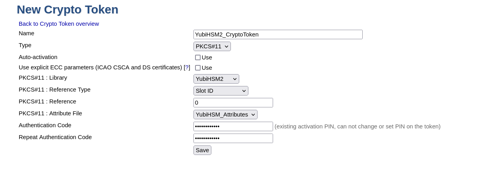

== EJBCA with YubiHSM 2

YubiHSM 2 works well with an existing installation of EJBCA as well as a new installation as long as the proper keys
are already created on the YubiHSM 2.

Due to design and implementation choices, there are some peculiarities when generating or importing keys into the
YubiHSM 2 using SunPKCS#11 provider and YubiHSM 2 PKCS#11 module. JAVA SunPKCS#11 provider requires the ability to
change a key's properties after creation in order for it to be able to use the keys later on. However, YubiHSM 2 does
not allow such operation (All key properties have to be set at the time of creation and cannot be changed after the
fact). This guide will describe 3 ways to work around this limitation.

NOTE: After generating new keys on the YubiHSM 2 for use by an existing installation
of EJBCA, the relevant crypto token must be reactivated before the new keys
are accessible by EJBCA.

NOTE: Once keys are visible on EJBCA Adminweb, testing and removing them can be done via the Crypto Token overview page
regardless of how they were generated.

NOTE: A 'key alias' on EJBCA is equivalent to a 'key label'
on the YubiHSM 2.

=== Prerequisites

Download the installation package suitable for the operation system from the
link:../Releases/index.adoc[Yubico Developers website]. The following packages should
be installed:

    * link:../Component_Reference/yubihsm-connector/index.adoc[YubiHSM Connector]
	* link:../Component_Reference/PKCS_11/index.adoc[YubiHSM PKCS#11 Library]
    * link:../Component_Reference/yubihsm-shell/index.adoc[YubiHSM Shell] (Optional depending on the method used to
generate asymmetric keys)
	* link:../Component_Reference/yubihsm-setup/index.adoc[YubiHSM Setup] (Optional depending on the method used to
generate asymmetric keys)

=== Generating Keys for EJBCA

==== EjbcaClientToolBox with YubiHSM 2 PKCS#11 module 2.4.0 or later

With a new PKCS#11 module, it is possible to use `ejbcaClientToolBox` to generate keys on the YubiHSM 2. For this to work,
a configuration file is used to specify the attributes required for this operation.

Example command to generate RSA key of length 2048 with the alias `test_key`:

	$ ./ejbcaClientToolBox PKCS11HSMKeyTool generate /path/to/sunpkcs11.config 2048 test_key

The content of `sunpkcs11.config` should be:

	name=YubiHSM2
	library=/path/to/yubihsm_pkcs11.so
	slot=0
	attributes(*,CKO_PRIVATE_KEY,CKK_RSA) = {
    	CKA_TOKEN = true
    	CKA_SIGN = true
	}
	attributes(*,CKO_PRIVATE_KEY,CKK_EC) = {
    	CKA_TOKEN = true
    	CKA_SIGN = true
	}

This will ensure that any RSA or EC keys generated on the YubiHSM 2 will be given the capability to sign and have the
`CKA_TOKEN` attribute set to the accepted value.

NOTE: This method will create additional objects on the YubiHSM 2 (See the section about "PKCS#11 with JAVA"
and the subsection about the later versions on link:../Component_Reference/PKCS_11/index.adoc[PKCS#11 with YubiHSM 2] for
details). So if the number of objects created on the YubiHSM 2 is an issue, use `yubihsm-setup` or `yubihsm-shell`
to generate the keys instead.

==== yubihsm-setup or yubihsm-shell

Either `yubihsm-setup` or `yubihsm-shell` can be used to make sure that both the generated keys and their corresponding
X509Certificates are stored under the same ObjectID on the YubiHSM 2. To do so, follow the instruction under the section
about "PKCS#11 with JAVA" and the subsection about the earlier versions on
link:../Component_Reference/PKCS_11/index.adoc[PKCS#11 with YubiHSM 2]

=== Configuring a New EJBCA Installation

NOTE: Generating keys on the YubiHSM 2 during the EJBCA installation process is not tested, so it is recommended to use
one of the methods described above to generate the keys before starting to install EJBCA

NOTE: It is recommended that the YubiHSM 2 PKCS#11 module and all related configuration files be owned by the same user
that runs the application server.

While following the installation instructions provided by EJBCA, the instructions
below need to be executed before deploying EJBCA for the first time:

1 . Decide how many keys to generate and what aliases they should have.
See the documentation in `EJBCA_HOME/conf/catoken.properties.sample` for
recommendation on what keys should be generated.

2 . Use one of the methods described above in "Generating Keys for EJBCA" to generate the keys on the YubiHSM 2, one
at a time. If using `yubihsm-shell`, use the capabilities
`sign-pkcs,sign-pss,sign-attestation-certificate` for RSA keys and `sign-ecdsa,sign-attestation-certificate` for EC
keys.

3 . If new keys are to be generated using EJBCA Adminweb, create the file `yubishm_pkcs11_attributes.conf`
with the following content (See the note under "EjbcaClientToolBox with YubiHSM PKCS#11 module 2.4.0 or later" for
details on why that might not be desirable):

	attributes(*,CKO_PRIVATE_KEY,CKK_RSA) = {
		CKA_TOKEN = true
		CKA_SIGN = true
	}
	attributes(*,CKO_PRIVATE_KEY,CKK_EC) = {
		CKA_TOKEN = true
		CKA_SIGN = true
	}

Make sure that `yubishm_pkcs11_attributes.conf` is owned by the same user that runs the application server.

4 . Set the environment variable `YUBIHSM_PKCS11_CONF` to the path of the
`yubihsm_pkcs11.conf` file. See link:../Component_Reference/PKCS_11/index.adoc[PKCS#11 with YubiHSM 2]
for the content of that file. Make sure that it is set in the same environment where the application server will be
running.

5 . When configuring EJBCA, make sure to include the following configurations in the properties files:

	* `EJBCA_HOME/conf/catoken.properties`:

		sharedLibrary=/path/to/yubihsm_pkcs11.so
		slotLabelType=SLOT_NUMBER
		slotLabelValue=0
		# Keys and their aliases as were created in step 2

	* `EJBCA_HOME/conf/install.properties`:

		ca.tokentype=org.cesecore.keys.token.PKCS11CryptoToken
		#ca.tokenpassword=null
		ca.tokenproperties=<EJBCA_HOME>/conf/catoken.properties

	* `EJBCA_HOME/conf/web.properties`:

		cryptotoken.p11.lib.255.name=<label to identify the YubiHSM 2>
		cryptotoken.p11.lib.255.file=/path/to/yubihsm_pkcs11.so
		# If new keys are to be generated using EJBCA Adminweb, fill the following two lines too
		cryptotoken.p11.attr.255.name=<label to identify the attribute file>
		cryptotoken.p11.attr.255.file=/path/to/yubishm_pkcs11_attributes.conf

NOTE: The number `255` is just an example. It can be any "available" number.
      See documentation in `EJBCA_HOME/conf/web.properties`

=== Configuring an Existing EJBCA installation

1 . If new keys are to be generated using EJBCA Adminweb, create the file `yubishm_pkcs11_attributes.conf`
with the following content (See the note under "EjbcaClientToolBox with YubiHSM PKCS#11 module 2.4.0 or later" for
details on why that might not be desirable):

	attributes(*,CKO_PRIVATE_KEY,CKK_RSA) = {
		CKA_TOKEN = true
		CKA_SIGN = true
	}
	attributes(*,CKO_PRIVATE_KEY,CKK_EC) = {
		CKA_TOKEN = true
		CKA_SIGN = true
	}

Make sure that `yubishm_pkcs11_attributes.conf` is owned by the same user that runs the application server.

2 . Set the environment variable `YUBIHSM_PKCS11_CONF` to the path of the
`yubihsm_pkcs11.conf` file. See link:../Component_Reference/PKCS_11/index.adoc[PKCS#11 with YubiHSM 2]
for the content of that file. Make sure that it is set in the same environment where the application server will be
running.

3 . Configure `EJBCA_HOME/conf/web.properties` as follows (`255` is just an example, read the
documentation in the file for more details):

	cryptotoken.p11.lib.255.name=<label to identify the YubiHSM 2>
	cryptotoken.p11.lib.255.file=/path/to/yubihsm_pkcs11.so
	# If new keys are to be generated using EJBCA Adminweb, fill the following two lines too
	cryptotoken.p11.attr.255.name=<label to identify the attribute file>
	cryptotoken.p11.attr.255.file=/path/to/yubishm_pkcs11_attributes.conf

4 . Re-deploy EJBCA and restart the application server

5 . On EJBCA Adminweb, create a new CryptoToken:

    a. Go to CA Functions -> Crypto Tokens
    b. Click on "Create new..."
    c. Configure the new CryptoToken as follows:
		* Name: <name for this crypto token>
		* Type: PKCS#11
		* Authentication Code: <password to open a sessoin on the YubiHSM 2.
		  See link:../Component_Reference/PKCS_11/index.adoc[PKCS#11 with YubiHSM 2] -> Logging In >
		* PKCS#11 : Library: <from the drop down menu, choose the label you set in step 3>
		* PKCS#11 : Reference Type: Slot ID
		* PKCS#11 : Reference: 0
		* PKCS#11 : Attribute File: <from the drop down menu, choose "Default" or the label you set for the attribute
file in step 3 >

	d. Click "Save". If there already are keys on the YubiHSM 2, a list of them will be
	displayed now (only keys with corresponding X509Certificates that can be accessed using the same ID will be
displayed).

IMPORTANT: The slot number of the shared PKCS#11 library has to be 0.

6 . When generating new keys, either use one of the methods described under "Generating Keys for EJBCA" (make sure to
deactivate and reactivate the Crypto Token before the new keys are ready to be used), or use EJBCA Adminweb to create
the new keys if `web.properties` is configured to do so.