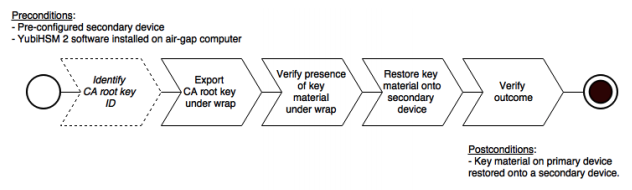

== Backing Up Key Material
*Backing Up Key Material*

We strongly recommend you make a backup copy of all production objects residing on your primary
device, particularly once the CA root key has been generated on the device. If there is an unforeseen
hardware failure of the primary device, having a backup ensures that you can resume operations
quickly. In addition, this provides a means to backup all objects contained on a device to reside in
secure hardware offline.
Specific recommendations for governance of your critical key material is out of scope for this guide.
Make sure to design and document these security procedures to fit the requirements of your
organization.

=== Backing Up the YubiHSM 2
The backup of the primary YubiHSM 2 is a duplicate of all of the objects stored on the primary device,
to be exported under wrap and that are available using the application authentication key used. For
instance, when following this guide, the wrap key (created with ID 2 previously), the application
authentication key (ID 3), the audit key (ID 4) (if created previously), and the CA root key will be
duplicated onto the secondary device. The factory-installed authentication key (ID 1) on the secondary
device will be destroyed. You will need assistance from the wrap key custodians to provide their
respective wrap key shares, if applicable. In the example we used in this guide, 2 out of the 3 shares
must be available.
When you create a backup, you create a duplicate of the objects on your primary YubiHSM 2 onto a
secondary device. The actual backup procedure consists of steps as follows. These steps are described
in detail in the following procedure.

--
. Set up communication between the YubiHSM 2 tools and the device.
. Start the configuration process, and authenticate to the YubiHSM 2 device.
. Identify the CA root key ID.
. Export the CA root key.
. Verify the key material under wrap.
. Restore the key material onto a secondary (backup) device.
. Verify the objects on the secondary device are correct.
--

Since the CA root key was created on the device when setting up the CA, it currently only exists on the
device. In order to back it up using the YubiHSM Setup program, it must first be exported from the
device using the wrap key that also sits on the device alongside the application authentication key and
the audit key.
To export the CA root key under wrap using the wrap key on the device

--
.	 In your command line application, run YubiHSM Shell program. To do this, if you haven’t already, launch your command line application and navigate to the directory containing the YubiHSM Shell program. Then run the following command and press Enter.

`$ yubihsm-shell`

.	 To connect to the YubiHSM, at the yubihsm prompt, type `connect` and press Enter. A message verifying that you have a successful connection is displayed.
.	 To open a session with the YubiHSM 2, type `session open 3` and press Enter.
.	 Type in the password for the application authentication key.
.	 You will receive a confirmation message that the session has been set up successfully.
.	 If you already know the object ID of the root CA, you can skip this step. If you need to identify the root CA, you can list the objects available. To list the objects, type `list objects 0` (where 0 is the session number) and press Enter. You will receive a list of the objects on the device that application authentication key with ID 3 has access to, which will include the CA root key. Identify its ID.
.	 To export the CA root key under wrap from the primary device to the local file system, in the YubiHSM Shell program, run
`yubihsm> get wrapped 0 2 asymmetric {rootkeyID} rootkey.yhw`
(Where 0 is the session number, 2 is the wrap key ID, asymmetric is the key type, {rootkeyID} is the CA root key with an ID assigned to it by the YubiHSM Key Storage Provider and rootkey.yhw is the name of the file output.) The file rootkey.yhw will be saved to the current working directory.
.	 Verify that all the keys that were exported under wrap to file reside in the same directory as the YubiHSM Setup program. The tool looks for files with the .yhw file extension in the current working directory and attempts to read and import them into the device. The wrap key will be imported as a result of providing the wrap key shares to the tool. Given the example object IDs in this guide, the following files should be present:
.. `0x0003.yhw` (Application authentication key under wrap)
.. `0x0004.yhw` (Audit key under wrap)
.. `rootkey.yhw` (CA root key under wrap)
.	 To begin the process of restoring the data onto the secondary YubiHSM 2, if the primary YubiHSM 2 device is inserted into your computer, remove it and insert the secondary device. Restoring a
device must be performed in an air-gapped environment in order to guarantee integrity.
.	 In your command line application (where $ is the prompt), run YubiHSM Setup with the argument `restore`. To do this, launch your command line application, navigate to the directory containing the YubiHSM Setup program, run the following command, and press Enter.
.. ``$ yubihsm-setup restore`
.	 To start the YubiHSM Setup process, type the default authentication key password: `password` and press Enter. A confirmation message is displayed that the default authentication key was used and that you successfully have authenticated to the device:
`Using authentication key 0x0001`
You will now start the restore procedure, which involves providing the number of wrap keyshares required by the privacy threshold defined when setting up the primary device.
.	 When prompted, type the number of shares required by the privacy threshold and press enter. In this guide, we have specified that 2 shares are required to be rejoined. These must be present in
order to proceed.
.	 When prompted, for share number 1, the wrap key custodian holding the first share inputs this information and presses Enter. A message is displayed that the share is received:
.. `Received share 2-1­
WWmTQj5PHGJQ4H9Y2ouURm8m75QkDOeYzFzOX1VyMpAOeF3YKYZyAVdM0WY4GErclVuAC`
.	 Continue to have each wrap key custodian enter the share information for each of the wrap key shares required to rejoin the key share. Once the sufficient number of wrap key shares have been inserted by the wrap key custodians, a final message is displayed:
.. `Stored wrap key with ID 0x0002 on the device`
.	 Note that the ID of the wrap key on the secondary device is the same as that for the primary device. Once the wrap key has been stored on the secondary device, the YubiHSM Setup program reads the files containing the application authentication key, the CA root key, and, if applicable, the audit key that were saved to file under wrap during the configuration of the primary device.
....
reading ./0x0004.yhw
Successfully imported object Authkey, with ID 0x0004
reading ./0x0003.yhw
Successfully imported object Authkey, with ID 0x0003
reading ./rootkey.yhw
Successfully imported object Asymmetric, with ID {rootkeyID}
....
If there are files containing wrapped objects with the .yhw file extension in this directory that
were exported with a different wrap key than the one reconstituted by the shares here, the setup
tool attempts to also read those but will fail gracefully and only restores the files it can decrypt.

The restore process finishes and the setup tool lets you know that the default, factory-installed authentication key has been deleted.

....
Previous authentication key 0x0001 deleted
All done
....
Finally, the YubiHSM Setup application exits.
--

=== Confirming the Duplicated YubiHSM 2
You now have a duplicate of the device configured with the three key objects you created on the primary device earlier. These are identical to the primary device that was configured earlier.

**To confirm the duplicated YubiHSM 2**
--
.	 In your command line application, run YubiHSM Shell program. To do this, if you haven’t already, launch your command line application and navigate to the directory containing the YubiHSM Shell program. Then run the following command and press Enter.
.. `$ yubihsm-shell`
.	 To connect to the YubiHSM, at the yubihsm prompt, type `connect` and press Enter. A message verifying that you have a successful connection is displayed.
.	 To open a session with the YubiHSM 2, type `session open 3` (where 3 is the ID for your application authentication key) and press Enter.
.	 Type in the password for the application authentication key. You will receive a confirmation message that the session has been set up successfully.
.	 To list the objects, type `list objects 0` (or instead of 0 some other session number that was given to you in step 4) and press Enter. Verify that the secondary device now contains all of the key material that you intended to restore.
.	 Depending on the order in which the keys under wrap were imported, the order of the enumerated keys on the secondary device may be different than on the primary device when using the list command. This has no practical implication and the object IDs are identical between the devices.

If you have verified that the secondary device now contains all of the key material that you intended to restore, you should now remove the keys under wrap currently on file in the current working directory for the YubiHSM Setup program.
