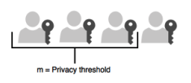

== Key Splitting and Key Custodians

The preferred method for backing up the YubiHSM 2 keys calls for key splitting and restoring or regenerating, often referred to as setting up an **'M of n’** scheme (https://dl.acm.org/doi/10.1145/359168.359176[Shamir’s Secret Sharing (SSS)]). This process ensures no individual can export key material from the YubiHSM 2, and provides a way to control the import of key material that has been exported under wrap from one device into other devices. For example, you would export and import objects for backup purposes, as described in link:Backing_Up_Key_Material.adoc[Back Up and Restore Key Material].

The key that is split among a predetermined number (**n**) of **key custodians** (also known as key shareholders) is known as the wrap key. Each custodian receives their own unique share. In order to use the key, a minimum number of shares (**m**) must be present so that the key can be regenerated (sometimes called "rejoined"). This minimum number of custodians is called the **privacy threshold**. If this threshold is not attained, the wrap key cannot be regenerated. This minimum number, **‘n’**, should be larger than one.

The exact number of key shares and the privacy threshold are determined by the requirements of your organization. If your organization has policies in place that define how this procedure should be performed, be sure you know these policies before proceeding. You should also have a predetermined practice in place specifying both:

* How the key shares must be recorded (written on paper, photographed, locally printed, or some other means) and
* How they must be stored between uses (for example, offsite archive, safety deposit box, sealed envelope).

**Figure 1 - Privacy threshold**

The YubiHSM Setup Tool enables you to perform the key splitting and assigning of shares to key custodians. To carry out the setup process, you need to know who the wrap key custodians will be. During setup, all key custodians must be physically present to record their shares. Exact instructions for key splitting and assigning of shares are given in link:Configuring_the_Primary_YubiHSM_2_Device.adoc[Configure the Primary YubiHSM 2 Device].

link:Installing_the_YubiHSM_2_Tools_and_Software.adoc[Next: Installing the YubiHSM 2 Tools and Software]
