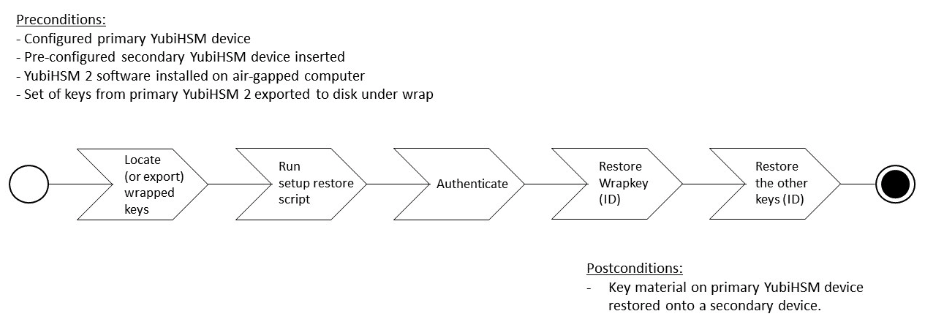

== Back Up and Restore Key Material

We strongly recommend making a backup copy of all production objects residing on your production devices, particularly once the asymmetric key has been generated on the YubiHSM 2. If there is a hardware failure of the production device, having a backup ensures that you can resume operations quickly. The backup process will result in two identical YubiHSM 2 devices with the same number of objects, keys, labels, etc.

[NOTE]
======
Making specific recommendations for governance of your critical key material is out of scope for this guide. Make sure to design these security procedures to meet the requirements of your organization - and then document them carefully.
======

=== Back Up the YubiHSM 2

The procedure described in this section is appropriate for testing and for smaller installations. For larger and/or more complex installations such as:

* Those whose setup did **not** involve the YubiHSM Setup program
* When moving the YubiHSM 2 device from one server to another

review the information on the Yubico developers’ website at link:../../Backup_and_Restore/[Backup and Restore] to determine whether the procedures set out there are more appropriate for your situation.

This guide gives instructions for duplicating the following on the secondary device:

* Wrap key (previously created with ID `2`),
* Application authentication key (ID `3`),
* Audit key (ID `4`) (if created previously)

The objects were exported under wrap. The factory-installed authentication key (ID `1`) on the secondary HSM 2 device will be destroyed, just as it was on the primary HSM 2 device. If you use actual wrap key custodians (instead of just doing a proof of concept), you will need the custodians to provide their respective wrap key shares. In the example we used in this guide, 2 out of the 3 custodians/shares must be available.

The link:../../Backup_and_Restore/[backup] of the primary YubiHSM 2 should thus contain a duplicate of each of the objects stored on the primary device. Availability of these objects is ensured by the same application authentication key as the one used for the primary YubiHSM 2.

To guarantee integrity, perform these operations in an air-gapped environment.

==== Overview of Procedure

The backup procedure consists of the following steps, which are described in detail in the next section, "Restore Keys on the Secondary YubiHSM 2 Device."

1. Locate the wrapped key material that was previously exported in "Procedure: Configuring Primary YubiHSM 2" in link:Configure_the_Primary_YubiHSM_2_Device.adoc[Configure the Primary YubiHSM 2 Device].

2. Set up communication between the YubiHSM 2 tools and the secondary (backup) YubiHSM 2 device.

3. Start the configuration process and authenticate to the secondary YubiHSM 2 device.

4. Restore the key material onto a secondary YubiHSM 2 device.

**Figure 4 - Flowchart illustrating backup and recovery of YubiHSM 2 keys**

[TIP]
=====
For *test purposes* you can set the `yubihsm-setup -d` flag to keep the default authentication-key with the administrative privileges; this will allow you to delete keys on the YubiHSM 2 for test purposes only. For *production purposes*; however, the `yubihsm-setup` command must be executed without the `-d` flag to ensure that the factory preset authentication key is properly deleted on the YubiHSM 2 device.
=====

=== Restore Keys on the Secondary YubiHSM 2 Device

*Step 1*: Verify that all the keys that were previously exported from the primary YubiHSM 2 under wrap are located in a directory to which you have read access.

If the necessary keys are not yet all available on disk, you can export the keys under wrap by running the following command:

....
$ yubihsm-setup dump
....

The YubiHSM Setup tool looks for files with the `.yhw` file extension in the current working directory and attempts to read and import them into the YubiHSM 2 device. The wrap key itself will be imported when the wrap key shares are provided to the tool.

For example, the following wrapped key files may be present:

* `0x0003-AuthenticationKey.yhw` (Application authentication key under wrap)

* `0x0004-AuthenticationKey.yhw` (Audit authentication key under wrap)

* `0x427a-Opaque.yhw`			(Certificate under wrap - not referenced by this guide in the configuration of the primary HSM 2)

* `0x427a-AsymmetricKey.yhw`		(Private asymmetric key under wrap - not referenced by this guide in the configuration of the primary HSM 2)

[TIP]
=====
If the initial authentication key (by default available as ID 0x0001) has been deleted, the new authentication application key will be identified with the flag `yubihsm-setup --authkey`. For example:

`$ yubihsm-setup --authkey 0x0003 dump`
=====

*Step 2*: To begin the process of restoring the data onto the secondary YubiHSM 2, if the primary YubiHSM 2 device is still inserted into your computer, remove it and insert the secondary device.

*Step 3*: In the directory containing the `*.yhw` files, run `yubihsm-setup` with the `restore` argument:

`$ yubihsm-setup restore`

*Step 4*: To start the YubiHSM Setup process, type the default authentication key password, which is `password`. A confirmation message like the following is displayed, announcing that the default authentication key was used and that you are authenticated to the YubiHSM 2 device:

`Using authentication key 0x0001`

You will now start the restore procedure, by providing the minimum number of wrap key shares required by the privacy threshold defined when setting up the primary HSM 2.

*Step 5*: When prompted, type the number of shares required by the privacy threshold. In the example used in this guide, we specified that two shares are required to regenerate the key. These must be present in order to proceed.

*Step 6*: When prompted for share number 1, the wrap key custodian holding the first share inputs this information. A message confirms that the share was received:

....
Received share 2-1WWmTQj5PHGJQ4H9Y2ouURm8m75QkDOeYzFzOX1VyMpAO…
....

*Step 7*: Continue to have each wrap key custodian enter the share information for each of the wrap key shares required to regenerate the wrap key. Once a sufficient number of wrap key shares have been entered by the wrap key custodians, a final message is displayed, indicating that the wrap key from the primary HSM 2 is now on the secondary HSM 2 as well:

....
Stored wrap key with ID 0x0002 on the device
....

[NOTE]
======
The ID of the wrap key on the secondary device is the same as the ID of the wrap key on the primary device.
======

*Step 8*: Once the wrap key has been stored on the secondary HSM 2, the YubiHSM Setup program reads the files containing the application authentication key and, if applicable, the audit key, which were saved to file under wrap during the configuration of the primary device. The output below shows that in this case, the Certificate Authority (CA) root key was also generated and exported along with a private asymmetric key, both under wrap.

....
reading ./0x0004.yhw
Successfully imported object Authkey, with ID 0x0004
reading ./0x0003.yhw
Successfully imported object Authkey, with ID 0x0003
reading ./0x427a-AsymmetricKey.yhw
Successfully imported object Asymmetric, with ID 0x427a
reading ./0x427a-Opaque.yhw
Successfully imported object Opaque, with ID 0x427a
....

*Step 9*: If there are files containing wrapped objects with the `*.yhw` file extension in this directory that were exported with a wrap key *other than* the one reconstituted by the shares here, the setup tool attempts to read those too, but will fail gracefully. The setup tool restores only the files it can decrypt.

*Step 10*: The restore process finishes and the setup tool informs you that the default factory-installed authentication key has been deleted.

....
Previous authentication key 0x0001 deleted

All done
....

The YubiHSM Setup application exits.

=== Verify the Duplicated YubiHSM 2

You should now have a secondary HSM 2 configured with the three key objects you created on the primary device earlier. Confirm that these key objects are identical to those on the primary device that was configured earlier:

*Step 1*: In the Command Prompt, run the YubiHSM Shell program:

`$ yubihsm-shell`

*Step 2*: To connect to the YubiHSM 2, at the `yubihsm` prompt, type `connect` and press *Enter*. A message confirming that you have a successful connection is displayed.

*Step 3*: To open a session with the YubiHSM 2, type `session open 3` (where `3` is the ID for your application authentication key) and press *Enter*.

*Step 4* Type in the password for the application authentication key. A  message confirming that the session has been set up successfully is displayed.

*Step 5* To list the objects, type `list objects 0` (or instead of `0` the session number that was given to you in step 4). Verify that the secondary device now contains all of the key material that you intended to back up or restore.

Depending on the order in which the keys under wrap were imported, the keys on the secondary device may not be listed in the same sequence as they are on the primary device when the `list` command is used. This has no practical implication and it is just the object IDs that need to be identical on the two devices.

If you have verified that the secondary device now contains all of the key material that you intended to restore, you should now remove the keys under wrap on file in the current working directory. The computer’s hard drive can be erased, too.

link:Getting_Help.adoc[Next: Getting Help]
