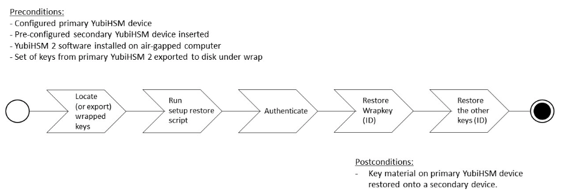

== Configure the Primary YubiHSM 2 Device

The YubiHSM Setup program is used to perform the initial configuration of the primary YubiHSM 2 device so that the necessary key material is generated on it:

* One wrap key to be split as described in "Key Splitting and Key Custodians" in https://developers.yubico.com/YubiHSM2/Usage_Guides/YubiHSM_2_Windows_Deployment_Guide/Prerequisites_and_Preparations.adoc[Prerequisites and Preparations].
* One application authentication key for authenticating to the YubiHSM 2 through the KSP. This allows the KSP to perform operations in the YubiHSM 2.

[NOTE]
======
This initial configuration replaces the default authentication key with a new one, which will only be operable in the same domain as the asymmetric key. The link:../../Concepts/Domain.adoc[domain concept] that is used to compartmentalize the YubiHSM 2 determines this behavior.
======

[TIP]
=====
For test purposes you can set the `yubihsm-setup -d` flag to keep the default authentication-key with the administrative privileges; this will allow you to delete keys on the YubiHSM 2 for test purposes only. For production purposes, however, the `yubihsm-setup` command must be executed without the `-d` flag to ensure that the factory preset authentication key is properly deleted from the YubiHSM 2 device.
=====

* One audit key for accessing the internal audit log of the device and resetting the audit log. The audit log retains information about the last 62 operations. It is also used to purge the log if needed. Depending on your local requirements, you may not need to create an audit key. If you are unsure of your requirements, we suggest you create an audit key.

The authentication key and the audit key are exported under wrap to a file in the current working directory on the machine where the YubiHSM Setup program is installed.

[TIP]
=====
The YubiHSM Setup tool has a help argument that you can call to learn more about its usage.
=====

=== Overview of Procedure

The configuration steps to be performed upon inserting the primary factory preset YubiHSM 2 device into the air-gapped system are set out briefly below. These steps are described in detail in the subsequent "Procedure: Configuring the Primary YubiHSM 2."

1. Set up communication between the YubiHSM 2 tools and the device.

2. Run the YubiHSM Setup with the argument `ksp`, specifying the Connector URL if necessary.

3. Start the YubiHSM Setup process and authenticate to the YubiHSM 2 device.

4. Add RSA decryption capabilities if required. If you plan to use your YubiHSM 2 exclusively with an application that only needs signing capabilities, RSA decryption is not required. Active Directory Certificate Services (ADCS), for example, does not require RSA decryption. However, if you are planning on using the same YubiHSM 2 device for something that does require the capability to decrypt RSA, then you do need RSA decryption. The Microsoft SQL Server Always Encrypted, for example, needs RSA decryption capabilities.

5. Enter the name of the domain in which you need the application authentication key and audit key to be available.

6. Generate the *wrap key* and its ID.

7. Split the wrap key into shares and specify the privacy threshold.

8. Have the wrap key custodians record their shares.

9. Create the *application authentication key*

10. Create the password for the application authentication key.

11. Create the *audit key* (optional).

12. Original default authentication key is deleted and setup process finishes.

**Figure 2 – Flowchart illustrating the YubiHSM 2 setup for Windows**

=== Procedure: Configuring the Primary YubiHSM 2

*Step 1*: Enable communication with the YubiHSM 2 device by running the YubiHSM Connector on the system where the device is inserted. If the YubiHSM Connector is running on a host machine to which the YubiHSM 2 is physically connected, the Connector should be started in networked mode. For example, if the host IP address is 192.168.100.252, the Connector should be started on the host machine with the following command:

....
$ yubihsm-connector -l 192.168.100.252:12345
....

In this scenario, you can verify that the Connector is running properly by typing the following URL into your web browser:

....
http://192.168.100.252:12345/connector/status
....

The output in the web browser should be similar to:

....
status=OK
serial=*
version=1.0.0
pid=*
address=192.168.100.252
port=12345
....

*Step 2*: In the Command Prompt, navigate to a directory for which you have write access and run the YubiHSM Setup with the argument `ksp`.

....
$ yubihsm-setup ksp
....

If the application calling it is installed on a machine other than the YubiHSM Connector, use the `connector` flag to specify the Connector URL, for example:

....
$ yubihsm-setup --connector http://192.168.100.252:12345 ksp
....

*Step 3*: To start the YubiHSM Setup process, type the default authentication key password `password`. A message confirms that the default authentication key was used and that you are authenticated to the device:

....
Using authentication key 0x0001
....

Object IDs are displayed in the YubiHSM Setup Tool using hexadecimal numbers. In this case the default authentication key is ID `1` (or `0x0001` in hexadecimal format).

*Step 4*: You are prompted to add RSA decryption capabilities. Enter `y` or `n`.

[TIP]
=====
If you are unsure what selection to make, select no (`n`).
=====

*Step 5*: You are prompted for the domain(s) you need the keys to be available in. Unless you have a requirement to assign more than one domain, enter a number between 1 and 16. In this guide, we assume that domain 1 was entered. The confirmation will look like one of the following:

....
got domains [
One
]
....

or

....
Using domains:
One
Enter wrap keyID (0 to choose automatically):
....

*Step 6*: You are prompted to generate a wrap key and enter its ID. Do one of the following:

* To manually assign a wrap key ID, type a number for the ID. As object ID `1` is already in use by the default application authentication key, we recommend assigning ID `2` to the wrap key.
* To allow the system to generate a wrap key ID automatically, type `0`.

In both cases, a confirmation message like the following is displayed:

....
Stored wrap key with ID 0x0002 on the device
....

*Step 7*: You are prompted to specify the number of shares into which the wrap key should be split in order to be distributed to an equal number of key custodians. You are also prompted to specify the privacy threshold, which is the number of shares that must be present for the wrap key to be regenerated. For this example, we  assume that the wrap key is split into three shares, of which at least two shares must be present in order to regenerate the key.

[NOTE]
======
For an overview of key custodian activities, see "Key Splitting and Key Custodians" in link:Prerequisites_and_Preparations.adoc[Prerequisites and Preparations].
======

[TIP]
=====
For test purposes, such as in a lab scenario where wrap key sharing is not crucial, it is not necessary to specify that the wrap key should be split between key custodians. Instead, you can use a single key. To do this, when configuring the device using YubiHSM Setup, indicate the number of shares to be `1` and the privacy threshold to be `1` as well.
=====

When prompted, do the following:

a. Enter the number of shares. In this example, enter `3`.

b. Enter the privacy threshold. In this example, enter `2`.

The wrap key thereby generated is saved to the HSM 2 device.

*Step 8*: When the relevant prompt is displayed, each of the three wrap key custodians should take their turn in front of the screen to record their share.

[IMPORTANT]
===========
Each custodian must record the whole string presented, including the prefix (in the following example, `2-1-`) which indicates the number of shares required to regenerate the key (the privacy threshold) and the number identifying where in the sequence the share was created.
===========

The following is an example of a share presented on the screen:

....
2-1-WWmTQj5PHGJQ4H9Y2ouURm8m75QkDOeYzFzOX1VyMpAOeF3YKYZyA…
Have you recorded the key share? (y/n)
....

A notice is displayed, warning that the shares are not stored anywhere.

a. To start having the custodians record the key shares, press **Enter**.

b. The first custodian records his or her share and confirms that the share was recorded by pressing `y`.  The screen buffer is cleared before the next share is presented.

c. The next custodian records the key share for the second share, confirms it, and so on.

*Step 9*: You are prompted to create an **application authentication key**. Since object IDs `1` and `2` are already in use by the default authentication key and the wrap key respectively, the example in this guide assumes that you enter ID `3` for the application authentication key. To allow the system to generate a wrap key ID automatically, type `0`.

*Step 10*: Create and enter a password of at least eight (8) characters for the application authentication key. Store it so that it cannot be compromised. You will need this password later to configure the YubiHSM KSP DLL, as described in link:Configure_the_YubiHSM_2_Software.adoc[Configure the YubiHSM 2 Software]. A confirmation message like the following appears:

....
Stored application authentication key with ID 0x0003 on the device
Saved wrapped application authentication key to 0x0003.yhw
....

The wrapped application authentication key (in this example, `0x0003.yhw`) is exported to the current working directory. Although the keys are encrypted using the wrap key, we recommend that you do not store keys - even under wrap - on network-accessible or any storage media that could be compromised. However, if you will be making a backup (and you should), leave the `*.yhw-file` with the wrapped authentication key where it was saved for now, deleting it *AFTER* you have made the backup.

*Step 11*: Decide whether to create an **audit authentication key**. To log into the YubiHSM 2 with the audit authentication key, both the key ID and the password will be needed.

a. When prompted to create an audit key, type `y`.

b. When prompted, assign a key ID to the audit key. Make a note of the ID you enter (for example, key ID `4`).

c. When prompted, enter the audit key password. Store this password so that it cannot be compromised.

The audit key is exported under wrap to the current working directory. Using our example of key ID `4`, the file will be named `0x0004.yhw`.

*Step 12*: The setup tool (in default mode) finishes by letting you know that the default authentication key has been deleted.

....
Previous authentication key 0x0001 deleted
All done
....

The YubiHSM Setup application exits. The YubiHSM 2 device is now equipped with the symmetric keys for wrap, audit, and application authentication.

link:Verify_the_YubiHSM_2_Setup.adoc[Verify the YubiHSM 2 Setup]
