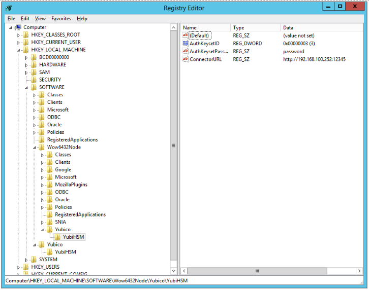

== Configure the YubiHSM 2 Software

There are two YubiHSM 2 software components to be configured before using the YubiHSM 2 on Windows:

* The YubiHSM 2 KSP.
* The YubiHSM 2 Connector service.

The configuration steps are described in the sections below.

[IMPORTANT]
===========
Make a backup of your Windows Registry before you make any changes.
===========

=== Configure the KSP Settings in the Windows Registry

To enable Microsoft Cryptographic API Next Generation (CNG) to access the YubiHSM 2 KSP, the following registry entries must be changed from their default values. The following subkeys were created during the YubiHSM SDK installation:

`HKEY_LOCAL_MACHINE\SOFTWARE\Yubico\YubiHSM (YubiHSM 64-bits KSP)`

*Step 1*: Click *Start > Run*, type `regedit` in the Run dialog box, and click *OK*.

*Step 2*: Select the registry subkey for the YubiHSM 64-bit KSP (`HKEY_LOCAL_MACHINE\SOFTWARE\Yubico\YubiHSM`).

*Step3*: Change the URI where the YubiHSM 2 Connector is listening by editing the following registry entry:

`“ConnectorURL”=http://127.0.0.1:12345`

For example, if the Connector is listening on IP address and port 192.168.100.252:12345, the `ConnectorURL` value should be changed accordingly.

*Step 4*: To change the ID of the application authentication key (object ID `3` was used as an example in this guide; if you used another object ID be sure to enter the correct information). For our example, because the hexadecimal value of 0x00000003 resolves to “3” in the Windows Registry, change the entry as follows:

`“AuthKeysetID”=3`

*Step 5*: To change the password for the application authentication key that is stored in the registry change the entry for:

`“AuthKeysetPassword”={password}`

The password is stored here for the Key Storage Provider to use when authenticating to the device.

*Step 6*: Locate and click the registry subkey for the YubiHSM 32-bit KSP (`HKEY_LOCAL_MACHINE\SOFTWARE\Wow6432Node\Yubico\YubiHSM`). Then repeat steps 3-5 above.

*Step 7*: To save your changes, exit the Windows Registry.

**Figure 3 – Registry settings for the YubiHSM 2 KSP**

=== Configure the YubiHSM 2 Connector Service

The YubiHSM Connector service reads the configuration file, `yubihsm-connector-config.yaml`. Depending on your local setup, for instance if you are running multiple instances of the software on the same host, you may need to edit this configuration file to ensure it is consistent with the Windows Registry, i.e.,  that the parameters and their values are the same in the configuration file and the Windows Registry.

On Windows, the `yubihsmconnector.config.yaml` file is available at `C:\programdata\yubiHSM\yubihsmconnector.yaml` - you will need administrator rights to modify the file.

link:Back_Up_and_Restore_Key_Material.adoc[Next: Back Up and Restore Key Material]
