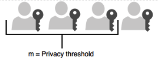

== Prerequisites and Preparations

The audience of this document is an experienced systems administrator with a good understanding of Microsoft Windows Server management. In addition, it is helpful to be familiar with the terminology, software, and tools specific to YubiHSM 2. As a primer for these, refer to the Terminology Used chapter.

In order to follow the steps provided in this guide, the following prerequisites must be met:

* Access to Microsoft Windows Server 2012 SP2 or higher, installed in a secure computer network. The system administrator must have elevated system privileges.

* The YubiHSM 2 SDK  downloaded from the Yubico YubiHSM 2 Release page and available on the system to be used. Installation instructions are given in the following.

* Two (2) YubiHSM 2 devices, one for deployment and one for backup in hardware.

* Key custodians, if your organization policies require them for the YubiHSM 2 deployment. For more information about key custodians and the associated ‘M of N’ key shares, see Yubico’s Understanding Key Splitting and Key Custodians.

[IMPORTANT]
===========
To safeguard the integrity of the device, it is recommended that the YubiHSM 2 configuration be performed on a fresh system in an air-gapped environment. To carry out an air-gapped installation, the steps in YubiHSM 2 Configuration Steps and Verifying the YubiHSM 2 Setup below should be performed on a stand-alone computer with Windows Server 2012 SP2 or higher and the YubiHSM 2 software installed.
===========

=== Key Splitting and Key Custodians

The preferred method for backing up the YubiHSM 2 keys calls for key splitting and restoring, often referred to as setting up an **'M of N’** scheme (https://cs.jhu.edu/~sdoshi/crypto/papers/shamirturing.pdf[Samir’s Secret Sharing (SSS)]). This process ensures no individual can export key material from the device, and provides a way to control the import of key material that has been exported under wrap from one device into other devices.

A key is split among a predetermined number (**n**) of **key custodians** (also known as key shareholders), giving each custodian his or her own unique share. In order to use the key, a minimum number of shares (**m**) must be present so that the key can be regenerated. This minimum number of custodians is called the **privacy threshold**. If this threshold is not attained, the key cannot be used. The number, **‘n’**, should be larger than 1. The exact number of key shares and the privacy threshold depend on the requirements of your organization.

The YubiHSM Setup Tool enables you to perform the key splitting and assign shares to key custodians. If your organization has policies in place that define how this procedure should be performed, be sure you know these policies before proceeding.

To complete the setup process, you need to know who the wrap key custodians will be. During setup, all key custodians must be physically present to record their shares. You should also have a predetermined practice in place specifying how the key shares must be recorded (written on paper, photographed, locally printed, or some other means) and how they must be stored between uses (for example, offsite archive, safety deposit box, sealed envelope).

link:Install_the_YubiHSM_Tools_and_Software.html[Next: Install the YubiHSM 2 Tools and Software]
