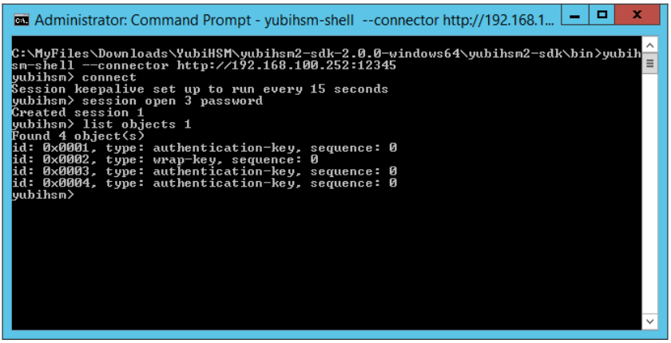

== Basic Setup of YubiHSM 2 and HGS

=== Install and Configuring YubiHSM 2

Install and configure the YubiHSM 2 and software using the instructions in the following sections in the link:../YubiHSM_2_Windows_Deployment_Guide[YubiHSM 2 Windows Deployment Guide]:

1. link:../YubiHSM_2_Windows_Deployment_Guide/Install_the_YubiHSM_Tools_and_Software.adoc[Install YubiHSM 2 Tools and Software]

2. link:../YubiHSM_2_Windows_Deployment_Guide/Configure_the_Primary_YubiHSM_2_Device.adoc[Configure the Primary YubiHSM 2 Device]

3. link:../YubiHSM_2_Windows_Deployment_Guide/Configure_the_YubiHSM_2_Software.adoc/[Configure the YubiHSM 2 Software]

Once these instructions have been followed, the YubiHSM 2 should be configured with the example we are using, one domain with a wrap key (id 0x0002), an application authentication key (id 0x0003), and an audit key (id 0x0004). The configuration of the YubiHSM 2 can be inspected by using the YubiHSM-Shell in a command prompt as shown in the screenshot below.

**Figure 2: Example of the YubiHSM 2 basic configuration**

=== Basic Deployment of HGS

To test the encryption and signing certificate/key generation for HGS Key Protection Services, configure a basic HGS environment on a single server.  For more information on how to install and configure a complete guarded fabric, see Microsoft’s link:https://docs.microsoft.com/en-us/windows-server/security/guarded-fabric-shielded-vm/guarded-fabric-and-shielded-vms-top-node[documentation on guarded fabric deployment].

To use shielded VMs, begin by adding the HGS role and configuring the HGS domain.

==== Step 1: Add HGS Role

To add the HGS role to a Windows Server, open a PowerShell console and enter the following command:

....
$ PS Install-WindowsFeature -Name HostGuardianServiceRole -IncludeManagementTools -Restart
....

For more information on this PowerShell command, see link:https://docs.microsoft.com/en-us/windows-server/security/guarded-fabric-shielded-vm/guarded-fabric-install-hgs-default[Microsoft’s documentation on how to Install HGS].

==== Step 2: Install Host Guardian Server on Bastion Host

To configure the Active Directory (AD) forest for HGS, configure the HGS service, and lock down the Windows Server to a bastion host, open a PowerShell console and enter the following command:

....
$ PS $adminPassword = ConvertTo-SecureString -AsPlainText '<password>' -Force

$ PS Install-HgsServer -HgsDomainName 'bastion.local' -SafeModeAdministratorPassword $adminPassword -Restart
....

For more information on this PowerShell command, see link:https://docs.microsoft.com/en-us/windows-server/security/guarded-fabric-shielded-vm/guarded-fabric-install-hgs-default[Microsoft’s documentation on how to Install HGS].

link:Create_Signing_and_Encryption_Keys_for_HGS.adoc[Next: Create Signing and Encryption Keys for HGS]
