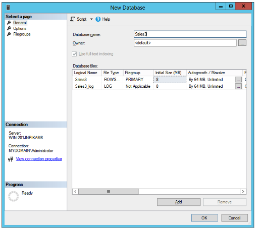

== Basic Setup of YubiHSM 2 and SQL Server

=== Installing and Configuring YubiHSM 2

Install and configure the YubiHSM 2 device and software using the instructions in the following sections in the link:../YubiHSM_2_Windows_Deployment_Guide\--Configure_YubiHSM_2_Key_Storage_Provider_for_Microsoft_Windows_Server[YubiHSM 2 Windows Deployment Guide--Configure YubiHSM 2 Key Storage Provider for Microsoft Windows Server]:

* link:../YubiHSM_2_Windows_Deployment_Guide\--Configure_YubiHSM_2_Key_Storage_Provider_for_Microsoft_Windows_Server/Install_the_YubiHSM_Tools_and_Software.adoc[Install the YubiHSM 2 Tools and Software]

* link:../YubiHSM_2_Windows_Deployment_Guide\--Configure_YubiHSM_2_Key_Storage_Provider_for_Microsoft_Windows_Server/Configure_the_Primary_YubiHSM_2_Device.adoc[Configure the Primary YubiHSM 2 Device]

* link:../YubiHSM_2_Windows_Deployment_Guide\--Configure_YubiHSM_2_Key_Storage_Provider_for_Microsoft_Windows_Server/Configure_the_YubiHSM_2_Software.adoc[Configure the YubiHSM 2 Software]

When these instructions have been completed, the YubiHSM 2 should be configured with -- for example --  one domain with a *wrap key* (id 0x0002), an *application authentication key* (id 0x0003), and an *audit key* (id 0x0004). The configuration of the YubiHSM 2 can be inspected by using the YubiHSM-Shell in a command prompt as shown in the screenshot below.

image::ex-yubi-hsm-2-basic-config.png[]

**Figure 1 - Example of the YubiHSM 2 basic configuration**

=== Creating a Test Database

Create a test database that will be used for the Always Encrypted deployment with YubiHSM 2. If you already have a Microsoft SQL Server database installed, you can skip ahead to link:Configure_SSMS_for_Database_Encryption.adoc[Configure SSMS for Database Encryption].

[NOTE]
======
At least one row with values needs to be inserted into the database table before the columns are encrypted (see Figure 4 below).
======

*Step 1* To create a test database, launch Microsoft SQL Server Management Studio (SSMS) 2018, right-click on the Databases icon, select *New Database...*, and enter an appropriate name for the database. In this guide, a test database named “Sales3” will be used for the tests with Always Encrypted in conjunction with YubiHSM 2.

**Figure 2 - Example of test database**

*Step 2* Expand *Databases > Sales3 > Tables*, right-click on *Tables* and select *Create new table…* Add some columns, for example "Name”, “Address”, “ZipCode”, “City”, “Country”. Save the table and give it the name “Table_Customers” for example.

image::ex-test-table.png[]

**Figure 3 - Example of test table**

*Step 3* Add one or more rows to the table by expanding *Databases > Sales3*, right-clicking on *Table* and selecting *New > Query...*  Use the SQL Query window to insert rows into the database table, for example, with the SQL query shown below.

image::ex-sql-query-to-insert-values-into-table.png[]

**Figure 4 - Example of SQL query to insert values into the table**

link:Use_SSMS_to_Generate_the_CMK_and_CEK.adoc[Next: Use SSMS to Generate the CMK and CEK]
