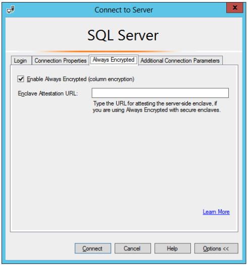
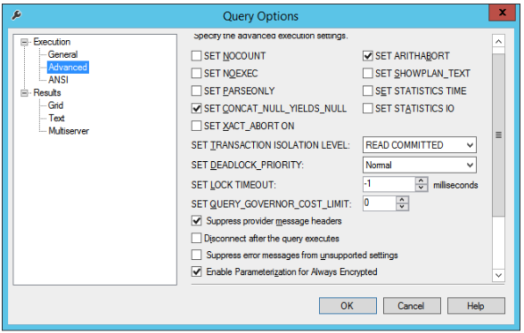

== Configure SSMS for Database Encryption

To configure Microsoft SQL Server and SSMS with the basic database settings needed for testing Always Encrypted in conjunction with YubiHSM 2, set SSMS to display the encrypted columns in clear text.

*Step 1* Click the *Connect Object Explorer* icon. The *Connect to Server* window appears. Click *Options, select the *Always Encrypted* tab, and seleck *Enable Always Encrypted (column encryption)*. To make the changes take effect, click the *Disconnect* icon and then the *Connect* icon.

**Figure 23 – Enable Always Encrypted in SSMS**

*Step 2* In the main menu, click *Query* and from the drop-down list, select *Query options...*. The *Query Options* window  appears. Select *Execution > Advanced* and the checkbox for *Enable Parameterization for Always Encrypted*.

**Figure 24 – Enable Parameterization for Always Encrypted queries in SSMS**

These are the basic database settings in Microsoft SQL Server and SSMS for testing Always Encrypted in conjunction with YubiHSM.

*Step 3* To verify the settings, expand the object *Database > Database-Name* (in our example the database name is Sales3), and select *New Query* in the top menu again. Re-enter the SQL query in the example below and click *Execute*.

....
SELECT * FROM Table_Customers;
....

When the SSMS settings take effect, the encrypted database columns are decrypted, and the values displayed in clear text as shown in the screenshot below.

image::25-decrypted-values-in-the-db-columns.png[]

**Figure 25 – Decrypted values in the database columns**

link:Back_Up_Key_Material.adoc[Next: Back Up Key Material]
