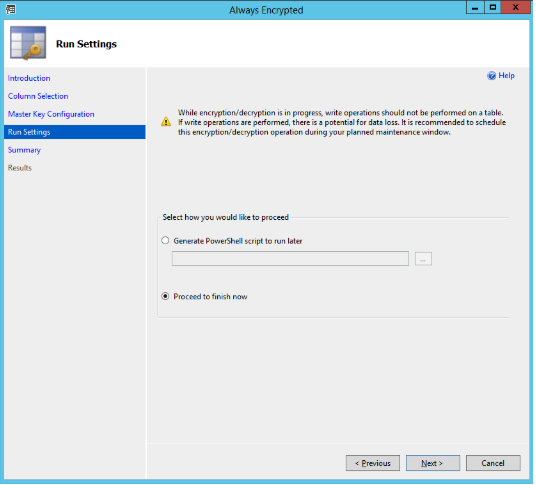
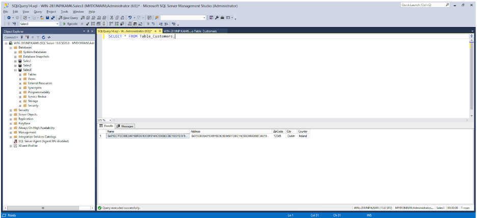

== Encrypt Database Columns

Database columns can be encrypted with PowerShell- or SSMS-generated keys.

=== Encrypt Database Column with PowerShell-generated Keys

*Step 1* To encrypt a database column, expand the database’s columns: *Databases > Database-Name > Tables > Table-Name > Columns*. Our example expands the tree *Databases > Sales3 > Tables > dbo.Table_Customers > Columns*, as shown in the screenshot below.

image::15-expanded-columns-to-be-encrypted.png[]

**Figure 15 - Expanded columns to be encrypted**

*Step 2* Right-click the column to be encrypted and select *Encrypt Column…* In our example, right-click the table *Name* and select *Encrypt Column…*  The *Introduction* window in the SSMS Always Encrypted wizard appears:

image::16-always-encrypted-wizard-introduction.png[]

**Figure - 16 Always Encrypted wizard: Introduction**

*Step 3* Click *Next*. The *Column Selection* window of the Always Encrypted wizard appears:

image::17-always-encrypted-wizard-column-selection.png[]

**Figure 17 - Always Encrypted wizard: Column Selection**

*Step 4* In this example, the CEK that was generated with the PowerShell script is used for encrypting the database column. In the *Column Selection* window, select the Encryption Key named *CEK-YubiHSM-PS*. The *Encryption Type* can be set to either *Deterministic* or *Randomized*; in this example Deterministic is selected. Click *Next*, and the *Master Key Configuration* window in the Always Encrypted wizard appears.

image::18-always-encrypted-wizard-master-key-configuration.png[]

**Figure 18 - Always Encrypted wizard: Master Key Configuration**

*Step 5* In the *Master Key Configuration* window, click *Next* button, since the master column key in the YubiHSM 2 will be used. The *Run Settings* window in the Always Encrypted wizard appears.

**Figure 19 - Always Encrypted wizard: Run Settings**

*Step 6* In the *Run Settings* window, select *Proceed to finish now* (unless you want to generate a PowerShell script to run later) and click *Next*. The *Summary* window in the Always Encrypted wizard appears.

image::20-always-encrypted-wizard-summary.png[]

**Figure 20 - Always encrypted wizard: Summary**

*Step 7* Review the settings in the *Summary* window and click *Finish*. The *Results* window appears:

image::21-always-encrypted-wizard-results.png[]

**Figure 21 - Always encrypted wizard: Results**

When the column encryption operation succeeds, the word “Passed” is displayed in the *Details* column of the relevant row in the Results window.

=== Encrypt Database Column with SSMS-generated Keys

to use the CMK and CEK that were generated in link:Use_SSMS_to_Generate_the_CMK_and_CEK.adoc[Use SSMS to Generate the CMK and CEK], follow the instructions above for encrypting a database column with PowerShell-generated keys (Encrypt Database Column with PowerShell-generated Keys), but select a different column (for example, *Address*) and use the column encryption key *CEK-YubiHSM-SSMS* and the related column master key *CMK-YubiHSM-SSMS*.

=== Verify Encrypted Database Column

To check that the columns have been encrypted, expand the object *Database > Database-Name* (in our example the database name is Sales3). Then select *New Query* in the top menu. Type the SQL query in the example below and click *Execute*.

....
SELECT * FROM Table_Customers;
....

**Figure 22 – Checking the encrypted columns**

link:Configure_SSMS_for_Database_Encryption.adoc[Next: Configure SSMS for Database Encryption]
