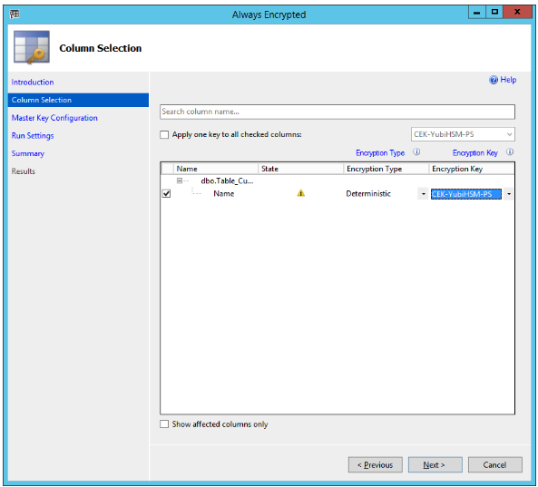

== Encrypt Database Columns

=== Encrypt Database Column with PowerShell-generated Keys

To encrypt a database column, begin by expanding the database’s columns as follows: *Databases > Database-Name > Tables > Table-Name > Columns*. Our example expands the tree *Databases > Sales3 > Tables > dbo.Table_Customers > Columns*, as shown in the screenshot below.

image::15-expanded-columns-to-be-encrypted.png[]

**Figure 15 - Expanded columns to be encrypted**

*Step 2* Right-click the column to be encrypted and select *Encrypt Column…* In our example, right-click the table *Name* and select *Encrypt Column…*  The *Introduction* window in the SSMS Always Encrypted wizard appears as shown in the screenshot below.

image::16-always-encrypted-wizard-introduction.png[]

**Figure - 16 Always Encrypted wizard introduction**

*Step 3* Click *Next*. The *Column Selection* window of the Always Encrypted appears.

**Figure 17 - Always encrypted wizard: Column Selection**

link:Configure_SSMS_for_Database_Encryption.adoc[Next: Back Up Key Material]
