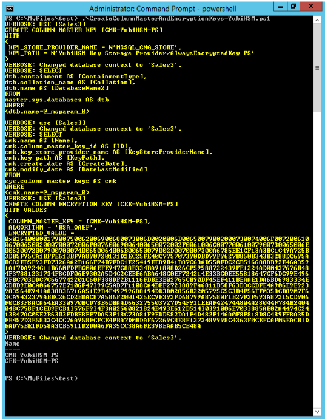

== Use PowerShell Script to Generate the CMK and CEK

Instead of using SSMS to generate the CMK and CEK (as described in the foregoing section, link:Use_SSMS_to_Generate_the_CMK_and_CEK.adoc[Use SSMS to Generate the CMK and CEK]), another option is to use PowerShell to generate the CMK and CEK. Microsoft has published a link:https://docs.microsoft.com/en-us/sql/relational-databases/security/encryption/configure-always-encrypted-keys-using-powershell?view=sql-server-2017[PowerShell script] that can be used to generate the CMK in an HSM. The following instructions list the activities in the script, then describe how to modify that PowerShell script to generate the CMK in the YubiHSM 2 by calling its KSP.

=== Create a CMK in the YubiHSM 2 with CNG Provider (KSP)

....
$cngProviderName = "YubiHSM Key Storage Provider"
$cngAlgorithmName = "RSA"
$cngKeySize = 2048 # Recommended key size for column master keys
$cngKeyName = "AlwaysEncryptedKey-PS" # Name identifying your key in the KSP
$cngProvider = New-Object System.Security.Cryptography.CngProvider($cngProviderName)
$cngKeyParams = New-Object System.Security.Cryptography.CngKeyCreationParameters
$cngKeyParams.provider = $cngProvider
$cngKeyParams.KeyCreationOptions = [System.Security.Cryptography.CngKeyCreationOptions]::OverwriteExistingKey
$keySizeProperty = New-Object System.Security.Cryptography.CngProperty("Length", [System.BitConverter]::GetBytes($cngKeySize), [System.Security.Cryptography.CngPropertyOptions]::None);
$cngKeyParams.Parameters.Add($keySizeProperty)
$cngAlgorithm = New-Object System.Security.Cryptography.CngAlgorithm($cngAlgorithmName)
$cngKey = [System.Security.Cryptography.CngKey]::Create($cngAlgorithm, $cngKeyName, $cngKeyParams)
....

=== Import SQL Server Module

....
Import-Module "SqlServer"
....

=== Connect to your Database

....
$serverName = "<server name>"
$databaseName = "<database name>"
$connStr = "Server = " + $serverName + "; Database = " + $databaseName + "; Integrated Security = True"
$connection = New-Object Microsoft.SqlServer.Management.Common.ServerConnection
$connection.ConnectionString = $connStr
$connection.Connect()
$server = New-Object Microsoft.SqlServer.Management.Smo.Server($connection)
$database = $server.Databases[$databaseName]
....

=== Create SQL CMK Settings Object for your CMK

....
$cmkSettings = New-SqlCngColumnMasterKeySettings -CngProviderName $cngProviderName -KeyName $cngKeyName
....

=== Create CMK Metadata in Database

....
$cmkName = "CMK-YubiHSM-PS"
New-SqlColumnMasterKey -Name $cmkName -InputObject $database -ColumnMasterKeySettings $cmkSettings -Verbose
....

=== Generate CEK, Encrypt with CMK, and Create CEK Metadata in Database

....
$cekName = "CEK-YubiHSM-PS"
New-SqlColumnEncryptionKey -Name $cekName -InputObject $database -ColumnMasterKeyName $cmkName -Verbose
....

=== Customize the Script

*Step 1* To customize this script, change the placeholders `server name` and `database name` to the actual values of the Microsoft SQL Server name and the database used. For the test database used in this example, the `database name` is set to `Sales3`, while the `server name` should be set to the name of your Windows server.

*Step 2* Save the PowerShell script file in a folder with an appropriate name, for example `CreateColumnMasterAndEncryptionKeys-YubiHSM.ps1`.

*Step 3* Launch a command prompt with administrator privileges and enter the PowerShell mode by typing `PowerShell`. Navigate to the directory where the PowerShell script is located, and execute the script:

....
$ PS> .\CreateColumnMasterAndEncryptionKeys-YubiHSM.ps1
....

The PowerShell script generates the CMK and the CEK, and displays the output from these operations. An example of such a script is shown in the screenshot below.

**Figure 12 - PowerShell script to create Column Master Key and Column Encryption Key**

=== Validate Generation of the CMK and the CEK

*Step 1* After executing the PowerShell script, switch back to SSMS, and expand the objects *Databases > Database-Name > Security > Column Master Key* and *Databases > Database-Name > Security > Column Encryption Key*. Right-click each object and select the *Refresh* option.

The CMK and CEK that were generated by the PowerShell script will appear in SSMS as `CMK-YubiHSM-PS` and `CEK-YubiHSM-PS` respectively.

image::13-cmks-and-ceks-in-ssms.png[]

**Figure 13 - Column Master Keys and Column Encryption Keys in SSMS**

*Step 2* Verify the presence of the asymmetric CMK in the YubiHSM 2 by running the following sequence of YubiHSM-Shell commands in a command prompt:

....
$ yubihsm> connect

$ yubihsm> session open <slot-ID> <password>

$ yubihsm> list objects <session-ID>

$ yubihsm> get objectinfo <session-ID> <key-ID> asymmetric-key
....

Example output for the YubiHSM-Shell commands is shown in the screenshot below.

image:14-cmks-in-yubihsm-2.png[]

**Figure 14 - Column Master Keys in YubiHSM 2**

link:Encrypt_Database_Columns.adoc[Next: Encrypt Database Columns]
