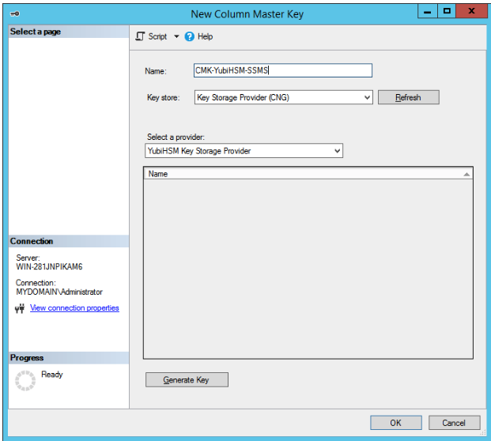
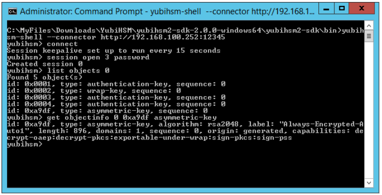
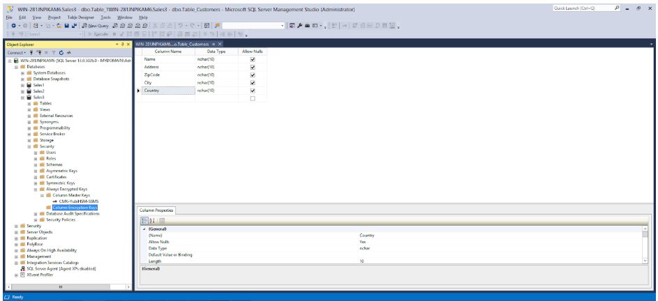
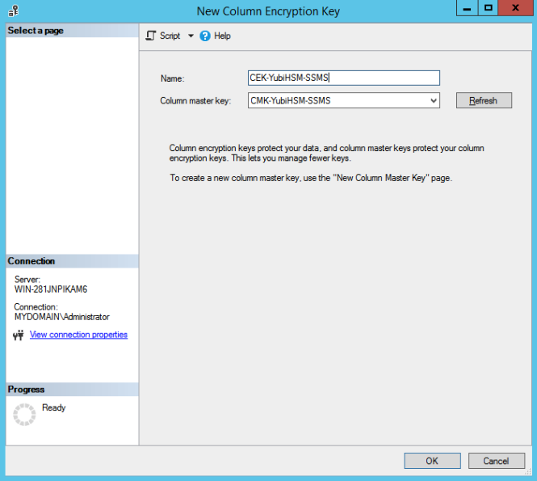

== Use SSMS to Generate the CMK and CEK

The Microsoft SQL Server Management Studio (SSMS) provides tools for manual creation of the CMK and CEK. These can also be generated using a PowerShell script (see link:Use_PowerShell_Script_to_Generate_the_CMK_and_CEK.adoc[Use PowerShell Script to Generate the CMK and CEK]. Note that all the examples and screenshots in this document are based on different key names being used for the SSMS wizard and the PowerShell script.

=== Generate the CMK

*Step 1* To generate the CMK for a database, launch SSMS and expand *Databases > Database-Name > Security > Column Master Key*. We use the example shown below, expanding the tree *Databases > Sales3 > Security > Column Master Key*.

image::ex-test-database.png[]

**Figure 5 – Column Master Keys in SSMS**

*Step 2* Right-click on *Column Master Keys*, and select *New Column Master Key…* In the *New Column Master Key* window, enter the following values:

* In the *Name* text field, enter an appropriate name for the CMK, for example, “CMK-YubiHSM-SSMS”.

* In the *Key Store* drop-down list, select *Key Storage Provider (CNG)*.

* In the *Select a provider* drop-down list, select *YubiHSM Key Storage Provider*.

**Figure 6 - Create new column master key with SSMS**

*Step 3* To generate an asymmetric key-pair on the YubiHsm 2, click *Generate Key*.

image::7-new-column-master-key-generated-in-ssms.png[]

**Figure 7 - New Column Master Key generated in SSMS**

==== Validate Generation of the CMK

The presence of the asymmetric CMK in the YubiHSM 2 can also be validated by running the following sequence of YubiHSM-Shell commands in a command prompt:

....
$ yubihsm> connect

$ yubihsm> session open <slot-ID> <password>

$ yubihsm> list objects <session-ID>

$ yubihsm> get objectinfo <session-ID> <key-ID> asymmetric-key
....

Example output from the YubiHSM-Shell commands is shown in the screenshot below.

**Figure 8 - New Column Master Key listed in YubiHSM**

=== Generate the CEK

The next step is to generate the CEK for a database.

*Step 1* To generate the CEK, launch SSMS and expand *Databases > Database-Name > Security > Column Encryption Key*. In our example, expand the tree *Databases > Sales3 > Security > Column Encryption Key*, which is illustrated in the screenshot below.

**Figure 9 - Column Encryption Keys in SSMS**

*Step 2* Right-click *Column Encryption Keys*, and select *New Column Encryption Key…*.

*Step 3* In the *New Encryption Master Key* window, enter the following values:

* In the *Name* text field, enter an appropriate name for the CEK, for example “CEK-YubiHSM-SSMS”.

* In the *Column master key* drop-down list, select the CMK that was generated on the YubiHSM, for example “CMK-YubiHSM-SSMS”.

**Figure 10 - Create new Column Encryption Key with SSMS**

*Step 4* To generate the CEK, press *OK*. To verify the success of the operation, check to see whether the CEK is listed under Always Encrypted Keys in SSMS.

image::11-column-master-key-and-column-encryption-key-in-ssms.png[]

**Figure 11 - Column Master Key and Column Encryption Key in SSMS**

link:Use_PowerShell_Script_to_Generate_the_CMK_and_CEK.adoc[Next: Use PowerShell Script to Generate the CMK and CEK]
